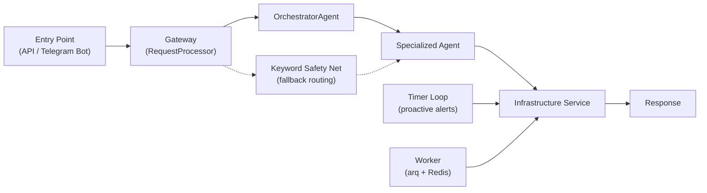

# Capivarex — Your Proactive AI Life Assistant

Capivarex is a "Jarvis-like" proactive AI assistant that integrates multiple services and provides contextual, intelligent assistance across various interfaces. It manages your daily life — from scheduling meetings and booking flights to controlling your smart home and making phone calls.

## 🚀 Features

### Core
- **33 Specialized AI Agents**: Sophisticated orchestrator routes requests to domain-specific agents
- **Shopping Intelligence**: Smart shopping list with receipt OCR, price tracking, grocery synonyms, and daily reminders
- **Voice Support**: Text-to-speech (ElevenLabs), speech-to-text (Whisper), and AI-powered phone calls (Twilio + Deepgram)
- **Automated Reports**: Monthly spending reports with Excel export, store rankings, and price drop alerts
- **Smart Notifications**: Proactive briefings, calendar alerts, shopping reminders, and price drop notifications
- **Keyword Safety Net**: Fallback routing ensures every message reaches the right agent even without AI classification
- **Proactive Assistance**: Initiates conversations and provides briefings based on your context
- **Multi-Language**: Full i18n support (EN/PT/ES) with 500+ translation keys
- **Persistent Memory**: Remembers your name, preferences, and personal info across all conversations
- **Multi-Interface**: Telegram Bot, REST API, WebSocket — designed for future, Device, WebApp (PWA) and smartwatch

### ✅ Implemented Agents & Services

| Agent | Description | Integration |
|-------|-------------|-------------|
| 🤖 **Orchestrator** | Intent analysis & agent routing | OpenAI GPT-4.1-mini |
| 💬 **Chat** | Conversational AI & general chat | OpenAI GPT-4.1-mini / GPT-5-mini |
| 📅 **Calendar** | Read/create events, scheduling | Google Calendar API |
| 🎥 **Meeting** | Create Google Meet video calls | Google Calendar API |
| 🏠 **SmartHome** | Control lights, sensors, locks | SmartThings OAuth2 (auto-refresh) |
| ✈️ **Travel** | Flight & hotel search with booking links | Duffel API + Booking.com |
| 🚗 **Car** | EV battery, location, charging, locks | Smartcar API |
| 🌤 **Weather** | Real-time forecasts | OpenWeatherMap |
| 💰 **Finance** | Real-time stock quotes | Twelve Data API |
| 🪙 **Crypto** | Cryptocurrency prices & tracking | CoinGecko API |
| 🔍 **Research** | Web search & synthesis | Perplexity Sonar AI |
| 🔎 **Search** | Structured web search results | Serper API |
| 💻 **Dev** | Code generation & explanation | Anthropic Claude |
| 🐙 **GitHub** | Create repos, manage code | GitHub API |
| 📞 **Twilio** | AI-powered phone calls via Telegram | Twilio + Deepgram |
| 🖼 **Image** | Generate images from text | Google Gemini |
| 🎬 **Video** | Generate videos from text | Google Gemini Veo |
| 🗣 **Voice** | Text-to-speech | ElevenLabs |
| 🚌 **Transport** | Public transport info | Transit APIs |
| 🛒 **Mercado** | Shopping list, receipts, price tracking | Supabase + Google Vision OCR |
| 📧 **Email** | Gmail read, send, manage | Gmail API (Google OAuth2) |
| 🎵 **Music** | Spotify search & recommendations | Spotify API |
| 📝 **Notes** | Personal note-taking & management | Supabase |
| 🔔 **Reminder** | Persistent reminders with date/time | Supabase |
| 🍽 **Restaurant** | Restaurant search & reviews | Google Places API |
| 🗺 **Maps** | Directions, places, navigation | Google Maps API |
| 🚦 **Traffic** | Real-time traffic conditions | Google Maps Traffic API |
| 🚶 **Leaving Now** | Departure time + ETA for events | Google Maps + Calendar |
| 📦 **Tracking** | Package & delivery tracking | 17TRACK API |
| 🌐 **Translate** | Text translation | AI-powered |
| ⏰ **Time** | Time zones & conversions | Built-in |
| ⏱ **Timer** | Alarms, timers, countdowns | Redis + Upstash |
| 📺 **YouTube** | YouTube search & trending videos | YouTube Data API |

### ⏳ Planned
- **WhatsApp Business**: Messaging interface
- **Virtual Avatar**: D-ID powered web avatar
- **WebApp (PWA)**: Full dashboard with settings

## 🔧 Tech Stack

| Layer | Technology |
|-------|-----------|
| **Backend** | Python 3.11, FastAPI |
| **Database** | Supabase (PostgreSQL) |
| **Cache** | Upstash Redis |
| **Auth** | JWT (JSON Web Tokens), Google OAuth2 |
| **AI Models** | OpenAI GPT-4.1-mini / GPT-5-mini, Anthropic Claude, Perplexity Sonar, Google Gemini Flash 2.0 |
| **Voice & Media** | ElevenLabs (TTS), Whisper (STT), Deepgram (real-time STT), Google Gemini Veo (video) |
| **Interfaces** | Telegram Bot, REST API, WebSockets |
| **Deploy** | Railway |
| **CI/Testing** | pytest (2555+ tests, 79%+ coverage), ruff |

## 🏗 Architecture



### Directory Structure

| Layer | Directory | Responsibility |
|-------|-----------|---------------|
| API | `api/` | REST endpoints & WebSocket (FastAPI), JWT auth |
| Telegram Bot | `telegram_bot/` | Telegram interface, message handlers, `mercado_callback.py` |
| Gateway | `utils/request_processor.py` | Request ID, rate limiting, user context |
| Orchestrator | `agents/specialized/orchestrator_agent.py` | Intent analysis, agent routing |
| Specialized Agents | `agents/specialized/` | 33 agents — one per domain (calendar, car, chat, dev, etc.) |
| Business Services | `services/business/` | ChatService, ProactivityService, UserProfileService, PromptCleaner, `grocery_synonyms.py` |
| Infrastructure | `services/infrastructure/` | Database (Supabase), Redis, Git, FileManager, Notifications, Sentry |
| Integrations | `services/integrations/` | Google Calendar, Smartcar, Weather, SmartThings, Duffel, Traffic, Gmail, Spotify |
| AI Services | `services/ai/` | OpenAI, Anthropic (Claude), Perplexity, ElevenLabs |
| Media Services | `services/media/` | Image, Video, Whisper (transcription) |
| i18n | `services/i18n/` | Internationalization (EN/PT/ES), `keywords.py` safety net |
| Autofix | `autofix/` | Autonomous bug triage and patching |
| Worker | `worker.py` | Async task processing via arq + Redis |

### Architectural Patterns
- **Service Registry** — All services register via `@register_service` and are accessed by `get_service(name)`
- **Agent Registry** — Agents register via `@register_agent` and are accessed by `get_agent(name)`
- **Circuit Breaker** — External integrations protected by `pybreaker`
- **Keyword Safety Net** — Dictionary-based fallback routing in `services/i18n/keywords.py`
- **Strategy Pattern** — Dictionary-based dispatch in ChatService and autofix
- **RequestProcessor** — Unified gateway for rate limiting, context, and observability

## 🚀 Getting Started

### Prerequisites
- Python 3.11+
- Supabase account
- Upstash Redis account
- API keys for services (OpenAI, Google, Perplexity, etc.)

### Installation

```bash
# Clone the repository
git clone https://github.com/cotah/capivarex.git
cd capivarex

# Create virtual environment
python -m venv .venv
source .venv/bin/activate  # Windows: .venv\Scripts\activate

# Install dependencies
pip install -r requirements.txt

# Configure environment
cp .env.example .env
# Edit .env with your API keys

# Configure Google credentials
cp credentials.example.json credentials.json
cp service_account.example.json service_account.json
# Edit JSON files with your Google Cloud Console credentials
```

> ⚠️ **Never commit** `.env`, `credentials.json`, or `service_account.json` to Git.

### Running with Docker (Recommended)

```bash
./start_all.sh
```
API available at `http://localhost:8000` — docs at `http://localhost:8000/docs`.

### Running without Docker

```bash
# API server
uvicorn api.main:app --reload --host 0.0.0.0 --port 8000

# Telegram bot
python telegram_bot/main.py

# Background worker (optional, requires Redis)
arq worker.WorkerSettings
```

### Running Tests

```bash
pytest tests/ -v
```

## 🔒 Security

### JWT Authentication
All API endpoints are protected by JWT. Generate a secure key:
```bash
python -c "import secrets; print(secrets.token_hex(64))"
```

Rotate the key if: exposed in a commit/log, suspected unauthorized access, team member leaves, or every 90 days. See `docs/JWT_ROTATION.md` for zero-downtime rotation.

### Environment Variables
All credentials stored via environment variables. For production, use a secret manager (AWS Secrets Manager, GCP Secret Manager, Doppler).

| Variable | Description |
|----------|-------------|
| `JWT_SECRET_KEY` | Signs/verifies JWT tokens (≥ 32 bytes random) |
| `OPENAI_API_KEY` | OpenAI API key |
| `ANTHROPIC_API_KEY` | Anthropic Claude API key |
| `GEMINI_API_KEY` | Google Gemini API key (image/video generation) |
| `ELEVENLABS_API_KEY` | ElevenLabs text-to-speech API key |
| `SONAR_API_KEY` | Perplexity Sonar API key (research) |
| `SUPABASE_URL` | Supabase project URL |
| `SUPABASE_SERVICE_KEY` | Supabase service role key |
| `UPSTASH_REDIS_REST_URL` | Upstash Redis REST URL |
| `UPSTASH_REDIS_REST_TOKEN` | Upstash Redis REST token |
| `REDIS_URL` | Redis socket URL (arq worker) |
| `TELEGRAM_BOT_TOKEN` | Telegram bot token |
| `GOOGLE_OAUTH_CLIENT_ID` | Google OAuth2 client ID (Calendar + Gmail) |
| `GOOGLE_OAUTH_CLIENT_SECRET` | Google OAuth2 client secret |
| `GOOGLE_MAPS_API_KEY` | Google Maps API key |
| `GOOGLE_PLACES_API_KEY` | Google Places API key (restaurants) |
| `SMARTTHINGS_CLIENT_ID` | SmartThings OAuth2 client ID |
| `SMARTTHINGS_CLIENT_SECRET` | SmartThings OAuth2 client secret |
| `SMARTCAR_CLIENT_ID` | Smartcar API client ID |
| `SMARTCAR_CLIENT_SECRET` | Smartcar API client secret |
| `TWILIO_ACCOUNT_SID` | Twilio account SID |
| `TWILIO_AUTH_TOKEN` | Twilio auth token |
| `DEEPGRAM_API_KEY` | Deepgram speech-to-text API key |
| `DUFFEL_ACCESS_TOKEN` | Duffel API token (flights) |
| `SERPER_API_KEY` | Serper API key (web search) |
| `17TRACK_API_KEY` | 17TRACK API key (package tracking) |
| `WEATHER_API_KEY` | OpenWeatherMap API key |
| `TWELVE_DATA_API_KEY` | Twelve Data API key (finance) |
| `SENTRY_DSN` | Sentry error tracking DSN |

See `.env.example` for the full list.

## 🤝 Contributing

1. Fork the project
2. Create your feature branch (`git checkout -b feature/AmazingFeature`)
3. Commit your changes (`git commit -m 'Add some AmazingFeature'`)
4. Push to the branch (`git push origin feature/AmazingFeature`)
5. Open a Pull Request

Please follow the existing code style and add tests for new functionality.

## 📄 License

MIT License — see [LICENSE](LICENSE) for details.
