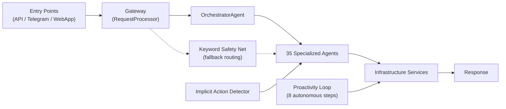

# Capivarex — Your Proactive AI Life Assistant

Capivarex is a "Jarvis-like" proactive AI assistant that **anticipates your needs** before you ask. It manages your daily life — from morning briefings and email triage to travel planning and smart home control — across Telegram, WebApp (PWA), and voice interfaces.

**What makes it different:** Capivarex doesn't just respond — it **thinks ahead**. It detects a trip in your calendar and offers to plan it. It checks your inbox and prioritizes what matters. It wakes you up with a personalized briefing combining weather, calendar, and finance. Every message sounds like a smart friend, not a robot.

## ✨ Intelligence Layer (S-TIER)

The brain of Capivarex — 9 proactive services that run autonomously:

| Service | What it does | Trigger |
|---------|-------------|---------|
| 🌅 **Morning Briefing** | Weather + calendar + finance + news in one warm message | Daily 06:00-10:00 UTC |
| 📋 **Meeting Briefing** | Prep with context from RAG 2h before meetings | Every 5 min cycle |
| 📈 **Finance Alerts** | Notifies when stocks/crypto cross your threshold | Every 5 min cycle |
| 📊 **Weekly Recap** | Personalized stock + crypto performance summary | Mondays 08:00-10:00 UTC |
| 📰 **Personalized News** | News tailored to your interests via RAG + Perplexity | 2x/day (07:00 + 18:00) |
| ✈️ **Travel Planner** | Detects trips in calendar → builds full itinerary | Daily 10:00-12:00 UTC |
| 🎙️ **Smart Actions** | "Nota que..." → auto-creates notes/reminders/events | Every message |
| 📬 **Email Triage** | Categorizes inbox by urgency, extracts action items | On demand |
| 🤝 **Meeting Orchestrator** | "Marca reunião" → event + Meet link + invite + notes | On demand |

**Rule: ALL output is humanized through GPT.** No templates, no robotic lists. Every message sounds like a smart friend with personality.

## 🤖 35 Specialized AI Agents

| Agent | Description | Integration |
|-------|-------------|-------------|
| 🧠 **Orchestrator** | Intent analysis & agent routing | OpenAI GPT-4.1-mini |
| 💬 **Chat** | Conversational AI with persistent memory (RAG) | OpenAI GPT-4.1-mini / GPT-5-mini |
| 📅 **Calendar** | Read/create events, scheduling | Google Calendar API (OAuth2) |
| 🎥 **Meeting** | Create Google Meet video calls | Google Calendar API |
| 🏠 **SmartHome** | Control lights, sensors, locks | Tuya Cloud API + SmartThings OAuth2 |
| ✈️ **Travel** | Flight & hotel search with booking links | Duffel API + Booking.com |
| 🚗 **Car** | EV battery, location, charging, locks | Smartcar API |
| 🌤️ **Weather** | Real-time forecasts & alerts | OpenWeatherMap |
| 💰 **Finance** | Stock quotes + watchlist management | Twelve Data API |
| 🪙 **Crypto** | Cryptocurrency prices & tracking | CoinGecko API |
| 🔍 **Research** | Web search & AI synthesis | Perplexity Sonar AI |
| 🔎 **Search** | Structured web search results | Serper API |
| 💻 **Dev** | Code generation & explanation | Anthropic Claude |
| 📧 **Email** | Gmail read, send, manage, triage | Gmail API (Google OAuth2) |
| 📞 **Twilio** | AI-powered phone calls | Twilio + Deepgram |
| 🖼️ **Image** | Generate images from text | Google Gemini |
| 🎬 **Video** | Generate videos from text | Google Gemini Veo |
| 🗣️ **Voice** | Text-to-speech | ElevenLabs |
| 🎵 **Music** | Search & recommendations | Spotify API |
| 📺 **YouTube** | Search & trending videos | YouTube Data API |
| 📝 **Notes** | Personal note-taking & management | Supabase |
| 🔔 **Reminder** | Persistent reminders with date/time | Supabase |
| 🛒 **Mercado** | Shopping list, receipt OCR, price tracking | Supabase + Google Vision |
| 🍽️ **Restaurant** | Restaurant search & reviews | Google Places API |
| 🗺️ **Maps** | Directions, places, navigation | Google Maps API |
| 🚦 **Traffic** | Real-time traffic conditions | Google Maps Traffic API |
| 🚶 **Leaving Now** | Departure time + ETA for events | Google Maps + Calendar |
| 🚌 **Transport** | Public transport info | Transit APIs |
| 📦 **Tracking** | Package & delivery tracking | 17TRACK API |
| 🌐 **Translate** | Text translation | AI-powered |
| ⏰ **Time** | Time zones & conversions | Built-in |
| ⏱️ **Timer** | Alarms, timers, countdowns | Redis + Upstash |
| 📡 **Media Cast** | Cast media to devices | Chromecast |
| 🐙 **GitHub** | Create repos, manage code | GitHub API |

## 🧩 Business Services

| Service | Purpose |
|---------|---------|
| `morning_briefing_service` | Daily briefing: weather + calendar + finance (humanized via GPT) |
| `meeting_briefing_service` | Meeting prep 2h before events with RAG context |
| `weekly_recap_service` | Weekly finance recap + watchlist management |
| `finance_alert_service` | Price movement alerts for stocks/crypto |
| `finance_news_service` | Personalized news per user via Perplexity + GPT |
| `travel_planner_service` | Trip detection → preference gathering → itinerary building |
| `implicit_action_service` | Detects "nota que..." → auto-creates notes/reminders/events |
| `email_triage_service` | Inbox categorization by urgency + action extraction |
| `meeting_orchestrator_service` | Full meeting setup: event + Meet link + invite + notes |
| `proactivity_service` | Context gathering + insight generation |
| `email_polling_service` | Background email monitoring |
| `chat_service` | Chat dispatch to specialized agents |
| `rag_service` | Retrieval-Augmented Generation (persistent memory) |
| `quota_service` | Usage quotas per plan (Free/Me/Everywhere/Family) |
| `mercado_service` | Shopping intelligence with OCR + price tracking |
| `leaving_now_service` | Smart departure alerts with traffic |
| `user_profile_service` | User preferences + profile management |

## 🔧 Tech Stack

| Layer | Technology |
|-------|-----------|
| **Backend** | Python 3.11, FastAPI |
| **Frontend** | Next.js 14, TypeScript, Tailwind CSS (PWA) |
| **Database** | Supabase (PostgreSQL) |
| **Cache** | Upstash Redis |
| **Auth** | JWT + Google OAuth2 + Tuya OAuth2 |
| **AI Models** | OpenAI GPT-4.1-mini / GPT-5-mini, Anthropic Claude, Perplexity Sonar, Google Gemini Flash 2.0 |
| **Voice & Media** | ElevenLabs (TTS), Whisper (STT), Deepgram (real-time STT), Google Gemini Veo (video) |
| **Smart Home** | Tuya Cloud API (device control, DP discovery, token refresh) |
| **Interfaces** | Telegram Bot, WebApp (PWA), REST API, WebSockets |
| **Deploy** | Railway (backend) + Vercel (frontend) |
| **CI/CD** | GitHub Actions (lint + test + security audit + Docker build) |
| **Testing** | pytest (3200+ tests, 79%+ coverage), ruff (0 errors) |
| **Monitoring** | Sentry (error tracking), circuit breakers (pybreaker) |

## 🏗️ Architecture



### Proactivity Loop (8 Steps)

Runs every 5 minutes, autonomously:

1. **Context checks** — proactivity insights for all users
2. **Email polling** — monitor for new emails
3. **News fetching** — personalized news 2x/day
4. **Finance alerts** — price movement detection
5. **Morning briefings** — daily briefing 06:00-10:00 UTC
6. **Meeting briefings** — prep 2h before meetings
7. **Weekly recap** — Mondays 08:00-10:00 UTC
8. **Travel detection** — scan calendar for upcoming trips

### Directory Structure

| Layer | Directory | Responsibility |
|-------|-----------|---------------|
| API | `api/` | REST endpoints, WebSocket, JWT auth (FastAPI) |
| Agents | `agents/specialized/` | 35 domain-specific agents |
| Business Services | `services/business/` | Intelligence layer, proactivity, RAG, chat |
| Infrastructure | `services/infrastructure/` | Database, Redis, Sentry, security |
| Integrations | `services/integrations/` | Google, Smartcar, Tuya, Duffel, Gmail, Spotify |
| AI Services | `services/ai/` | OpenAI, Anthropic, Perplexity, ElevenLabs |
| Auth | `services/auth/` | Google OAuth2, Spotify OAuth2, Tuya OAuth2 |
| Media | `services/media/` | Image, Video, Whisper (transcription) |
| i18n | `services/i18n/` | Internationalization (EN/PT/ES), keyword safety net |
| Tests | `tests/` | 94 test files, 3200+ tests |

### Architectural Patterns

- **Service Registry** — `@register_service` + `get_service(name)`
- **Agent Registry** — `@register_agent` + `get_agent(name)`
- **Circuit Breaker** — External integrations protected by `pybreaker`
- **Keyword Safety Net** — Dictionary-based fallback routing
- **RAG Memory** — Persistent user context across conversations
- **GPT Humanization** — All proactive output passes through GPT for natural language
- **State Machine** — Travel planner uses stateful conversation (detected → gathering → building → reviewing → finalized)

## 🚀 Getting Started

### Prerequisites

- Python 3.11+
- Supabase account
- Upstash Redis account
- API keys for services (OpenAI, Google, Perplexity, etc.)

### Installation

```bash
git clone https://github.com/cotah/capivarex.git
cd capivarex

python -m venv .venv
source .venv/bin/activate

pip install -r requirements.txt

cp .env.example .env
# Edit .env with your API keys
```

> ⚠️ **Never commit** `.env`, `credentials.json`, or `service_account.json` to Git.

### Running

```bash
# API server
uvicorn api.main:app --reload --host 0.0.0.0 --port 8000

# Telegram bot
python telegram_bot/main.py

# Background worker (optional)
arq worker.WorkerSettings
```

### Running Tests

```bash
# Full suite
pytest tests/ -q

# Specific module
pytest tests/test_morning_briefing_service.py -v

# With coverage
pytest tests/ --cov=. --cov-report=term-missing -q
```

## 🔒 Security

- **JWT Authentication** — All API endpoints protected
- **Google OAuth2** — Calendar, Gmail, Meet
- **Tuya OAuth2** — Smart home device control with token refresh
- **Circuit Breakers** — Prevent cascading failures
- **pip-audit** — Automated vulnerability scanning in CI
- **Secrets** — All credentials via environment variables

## 📊 Project Metrics

| Metric | Value |
|--------|-------|
| Specialized Agents | 35 |
| Business Services | 34 |
| Test Files | 94 |
| Total Tests | 3200+ |
| Code Coverage | 79%+ |
| Python Files | 363 |
| Ruff Errors | 0 |
| CI Pipeline | Lint → Test → Security → Docker |

## 📄 License

MIT License — see [LICENSE](LICENSE) for details.
